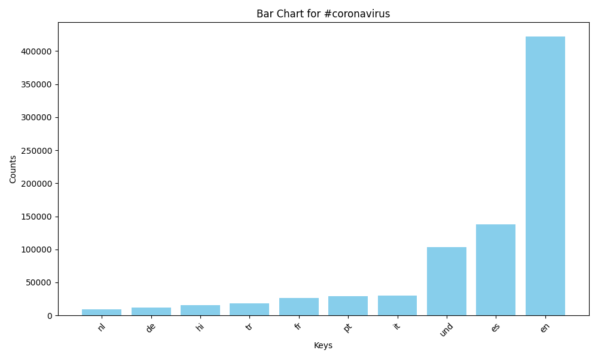
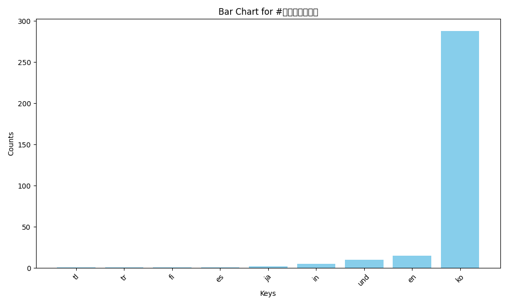
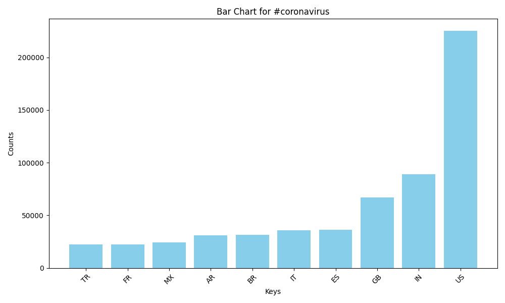
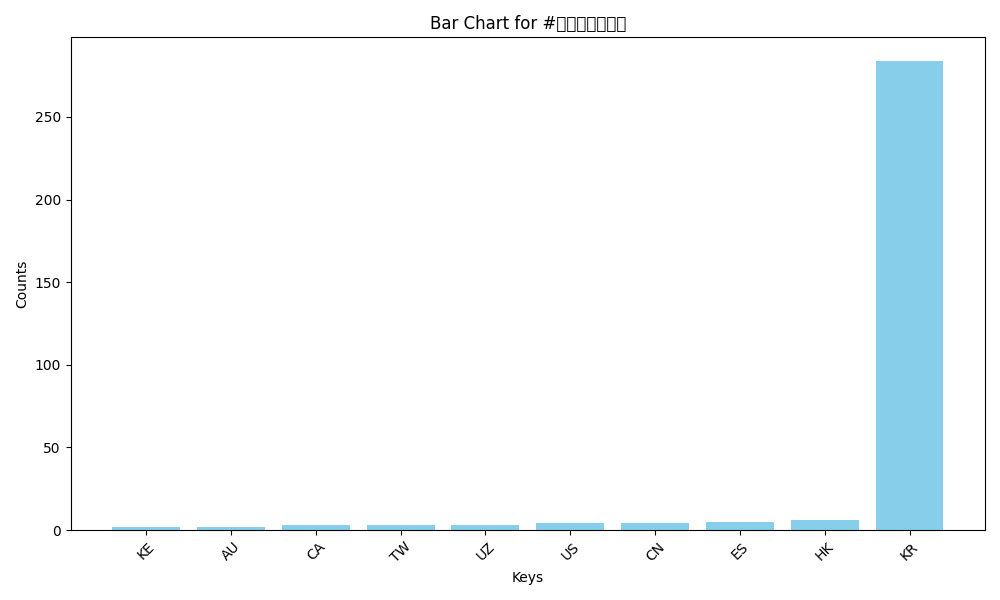

# Twitter Coronavirus Analysis

## Project Overview

This project analyzes geotagged tweets from 2020 to monitor the spread of the coronavirus on social media. Using the MapReduce paradigm, the project processes large-scale tweet data to extract insights related to tweet languages and geographical origins, with a focus on coronavirus-related hashtags.

### Key Components:
- **Mapping (map.py):**  
  Processes daily tweet zip files to extract language and country information, as well as counts for specific hashtags such as `#coronavirus` and `#코로나바이러스`.
- **Reducing (reduce.py):**  
  Aggregates the mapper outputs, combining counts for both language and country across all processed days.
- **Visualization (visualize.py):**  
  Generates bar graphs from the reduced data, illustrating the distribution of tweets by language and country for the specified hashtags.
- **Alternative Reducer (alternative_reduce.py):**  
  Creates a line plot that shows the daily tweet counts for selected hashtags throughout the year.

## Generated Output Images

### Language Analysis
- **#coronavirus:**  
  
- **#코로나바이러스:**  
  

### Country Analysis
- **#coronavirus:**  
  
- **#코로나바이러스:**  
  

## How to Run the Project

1. **Mapping:**  
   Use the `run_maps.sh` script to process each daily tweet file in parallel.
2. **Reducing:**  
   Run `reduce.py` to combine mapper outputs into aggregated data files.
3. **Visualization:**  
   Execute `visualize.py` to generate the bar graphs and `alternative_reduce.py` for the daily trend line plot.
